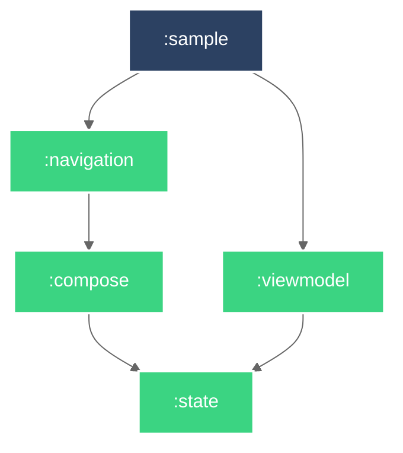

# Android Compose UI 라이브러리

Android Compose UI + Material Design을 사용한 Android UI 라이브러리.

## 개발 환경 설정

TBD

## Module Graph

## 문서

- [Architecture Decision Records](doc/adr/README.md)

## 참고

- [New personal access token (classic)](https://github.com/settings/tokens/new)
- [iurysza/module-graph](https://github.com/iurysza/module-graph)
- [.ignore](https://plugins.jetbrains.com/plugin/7495--ignore)